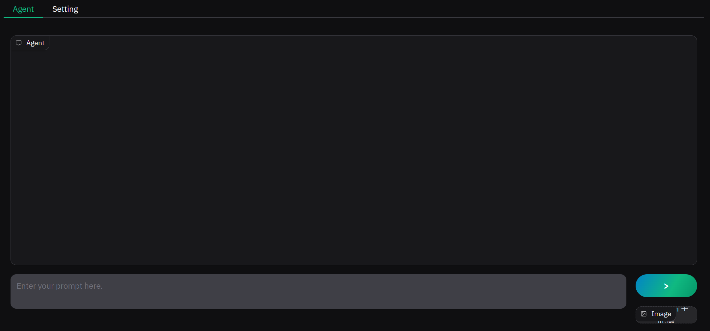
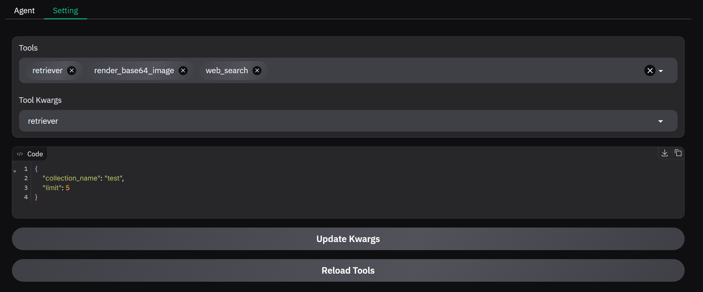

## Get started

1. `pip install uv`
2. `uv pip install -r requirements.txt`
3. `cp .env.example .env` then edit `.env`
4. `python main.py`

## Lint
`ruff format .`

## Preview

- agent with image input
    
- dynamic tools setting
    

## Dynamic Tools Support

The smolagents does not work well when reset memory flag is False, especially for tools removing (see [#881](https://github.com/huggingface/smolagents/issues/881)).
But we found a way to do that via updating available tools in each user prompt.
You can add/update/delete any `.py` files under `./plugins` directory without restarting the app, just 
click the `reload tools` button on UI.
If you want to add new tools for the running gradio agent UI, plz follow below format:
```
from smolagents import Tool


class NewTool(Tool):
    name = "your_tool_name"
    description = "your_tool_description"
    inputs = {
        "arg1": {
            "type": "string",
            "description": "your_arg_description",
        }
    }
    output_type = "string"
    # add default_kwargs if you want to update kwargs from ui
    default_kwargs = {"var1": "test", "var2": 5}
    
    # can only have **kwargs
    def __init__(self, **kwargs):
        super().__init__(**kwargs)
        self.kwargs = {**self.default_kwargs, **kwargs}
        self.collection_name = (
            self.default_kwargs["var1"]
            if kwargs.get("var1") is None
            else kwargs["var1"]
        )
        self.limit = (
            self.default_kwargs["var2"]
            if kwargs.get("var2") is None
            else kwargs["var2"]
        )

    def forward(self, arg1: str) -> str:
        # do your tool logic and return output
        return "done"


# must have var tools of classes
tools = [NewTool]
```
